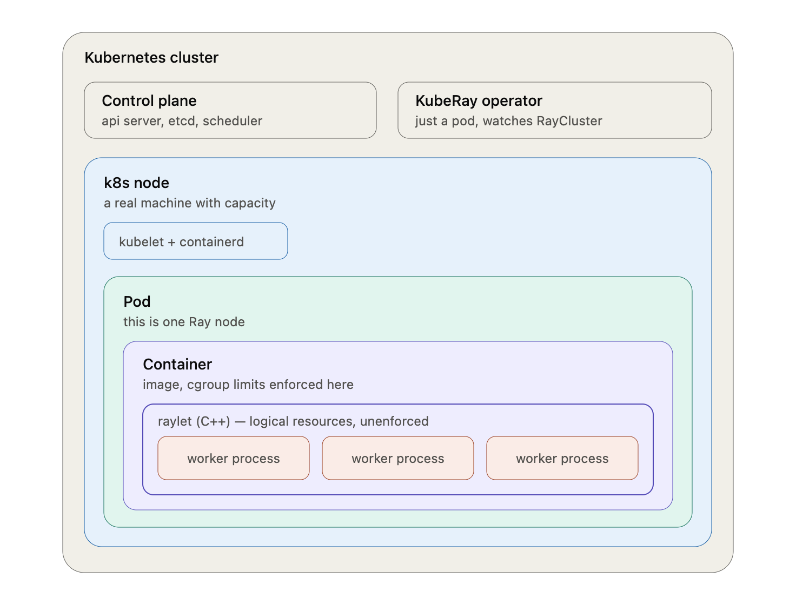

# Chapter 1: Foundations

Docker, Kubernetes, kubectl, Helm and Ray, learned by building a three-node cluster on your laptop and running a distributed job on it.

**You will have:** a local Kubernetes cluster, a load-balanced Service, and a Ray cluster running a job across its workers.

**You will measure:** 3 Ready nodes, a `curl` response, and how long a full rebuild from files takes (about 3 minutes).

## Files

| File | What it is |
| --- | --- |
| `kind-config.yaml` | The cluster: one control plane, two workers |
| `manifests/whoami.yaml` | A Deployment and Service that echo the pod hostname |
| `manifests/raycluster.yaml` | A Ray head and worker pool, managed by KubeRay |
| `jobs/where_am_i.py` | A Ray job that reports which workers ran its tasks |

## Prerequisites

- Docker Desktop with its memory limit raised to 10 GB (gear icon, Resources).
- Homebrew on macOS. On Linux, install the same tools from their release pages.
- Tested on a 2021 M1 Mac with 16 GB RAM.

## 1. Install the tools

```
brew install kind kubectl helm
curl -LsSf https://astral.sh/uv/install.sh | sh
uv sync
```

- kind runs Kubernetes nodes as Docker containers, so no cloud bill yet.
- kubectl is the CLI to the cluster's API server.
- Helm installs packaged, templated manifests (charts).
- uv creates the Python environment and pins Ray to the version the cluster runs.

Optional: reclaim Docker disk space first.

```
docker system df
docker builder prune
```

## 2. Create the cluster

`kind-config.yaml`, line by line:

- `kind: Cluster` is the object type. Every Kubernetes-style object has a `kind` field; the collision with the tool name is a coincidence.
- `apiVersion` is `group/version`: who owns the schema and which revision. `v1alpha4` is nominally alpha but has been unchanged for years.
- `nodes` is a list. Each entry becomes one Docker container running a full Kubernetes node. In a real cluster each would be a machine.

```
kind create cluster --config chapters/01-foundations/kind-config.yaml
kubectl get nodes
kubectl get pods -A
docker ps
```

Expected: three nodes in `Ready`, and three `kindest/node` containers in `docker ps`. In the system pods, map each name to its component:

- Control plane, on `kind-cluster-control-plane` only: `etcd`, `kube-apiserver`, `kube-controller-manager`, `kube-scheduler`.
- Per node: `kindnet` (networking) and `kube-proxy` (Service routing).
- Cluster add-ons: `coredns` (DNS) and `local-path-provisioner` (storage).

## 3. Deploy a Service

`manifests/whoami.yaml` holds two objects separated by `---`. `kubectl apply` treats each as independent.

- `metadata.name` identifies the object. It must be unique per kind within a namespace; with none given, the `default` namespace is used.
- `spec.replicas` is the desired pod count.
- `spec.selector.matchLabels` says which pods belong to this Deployment: any pod labeled `app=whoami`.
- `spec.template` is the pod blueprint. Its `labels` must match the selector.
- The Service's `selector` routes traffic to pods with those labels. Pods come and go and change IPs; the Service keeps a stable IP and DNS name, and the control plane keeps an EndpointSlice of the pods currently behind it.

Look up any field with `kubectl explain deployment.spec.template`.

```
kubectl apply -f chapters/01-foundations/manifests/whoami.yaml
kubectl get pods -o wide -w
kubectl get svc whoami
```

Wait until both pods are `Running`, then forward local port 8080 to the Service's port 80:

```
kubectl port-forward svc/whoami 8080:80
```

In another terminal:

```
for i in 1 2 3 4 5 6; do curl -s localhost:8080 | grep Hostname; done
```

Only one hostname appears. `port-forward` opens a tunnel to a single pod and stays on it, bypassing the Service's load balancing. To see both pods, send requests from inside the cluster through the Service's DNS name:

```
kubectl run curl --image=curlimages/curl --restart=Never -- sh -c 'for i in $(seq 1 20); do curl -s whoami | grep Hostname; done'
kubectl wait --for=jsonpath='{.status.phase}'=Succeeded pod/curl
kubectl logs curl
kubectl delete pod curl
```

## 4. Install the KubeRay operator

KubeRay is a Kubernetes operator: a pod that watches `RayCluster` objects and creates the pods they describe.



```
helm repo add kuberay https://ray-project.github.io/kuberay-helm/
helm repo update
helm search repo kuberay
helm install kuberay kuberay/kuberay-operator --version 1.7.0
kubectl get pods
```

`kuberay` is the Helm release name, used by `helm upgrade` and `helm uninstall`. The Deployment it creates is named `kuberay-operator`, because the chart hardcodes that. Inspect it with:

```
kubectl get deployment kuberay-operator -o yaml
```

## 5. Deploy a Ray cluster

Confirm the Ray image has a build for your architecture (arm64 on Apple Silicon):

```
docker manifest inspect rayproject/ray:2.58.0-py312
```

`manifests/raycluster.yaml`, field by field:

- `rayVersion` tells the operator which Ray it manages. Match it to the image tag.
- `headGroupSpec` is the one head pod. It runs the global control store, the dashboard and the job server. `dashboard-host: 0.0.0.0` lets `port-forward` reach the dashboard. `num-cpus: "0"` keeps tasks off the head, the standard production setting.
- `workerGroupSpecs` is a list so you can have differently shaped pools, for example CPU and GPU. `replicas` is what you want now. `minReplicas` and `maxReplicas` bound the Ray autoscaler, which is off until chapter 5.
- `resources.requests` is what the scheduler uses to place a pod. `limits` is what the kernel enforces. Equal values give predictable behavior, and Ray sizes its worker pool from what it sees.

```
kubectl apply -f chapters/01-foundations/manifests/raycluster.yaml
kubectl get raycluster
kubectl describe raycluster mini
kubectl get events --sort-by=.lastTimestamp
```

Expected: `STATUS` is `ready` with 2 available workers. Then open the dashboard:

```
kubectl get svc
kubectl port-forward svc/mini-head-svc 8265:8265
```

At http://localhost:8265/#/cluster you should see one `mini-head-*` node and two `mini-workers-worker-*` nodes.


## 6. Run a job

`jobs/where_am_i.py` runs 40 tasks that each return their hostname, then prints the count per host and the cluster's resources.

```
uv run ray job submit --address http://localhost:8265 --working-dir chapters/01-foundations/jobs -- python where_am_i.py
```

Expected: two hostnames in the counter, and the job listed under Jobs in the dashboard. The driver runs on the head pod; your laptop only uploads the directory and streams logs.

The job went to port 8265 because that is the Jobs API. The head Service exposes several:

| Port | Purpose |
| --- | --- |
| 6379 | Global Control Store |
| 8265 | Dashboard and Jobs REST API |
| 10001 | Ray Client gRPC |
| 8080 | Prometheus metrics |
| 8000 | Ray Serve HTTP ingress |


## 7. Scale the workers

Change `replicas: 2` to `replicas: 3` in the worker group of `manifests/raycluster.yaml`, apply, and watch the new pod land on one of the two kind workers:

```
kubectl apply -f chapters/01-foundations/manifests/raycluster.yaml
kubectl get pods -o wide -w
```

Submit the job again. Three hostnames now appear:

```
uv run ray job submit --address http://localhost:8265 --working-dir chapters/01-foundations/jobs -- python where_am_i.py
```

Worker template changes are reconciled live. Head template changes are not; those need `kubectl delete -f` then `apply -f`.

## 8. Rebuild from files and time it

Delete everything and recreate it from the checked-in files. Time it.

```
kind delete cluster --name kind-cluster
kind create cluster --config chapters/01-foundations/kind-config.yaml
kubectl apply -f chapters/01-foundations/manifests/whoami.yaml
helm install kuberay kuberay/kuberay-operator --version 1.7.0
kubectl apply -f chapters/01-foundations/manifests/raycluster.yaml
kubectl get pods -w
```

Once all pods are ready, in a second terminal:

```
kubectl port-forward svc/mini-head-svc 8265:8265
```

And in a third:

```
uv run ray job submit --address http://localhost:8265 --working-dir chapters/01-foundations/jobs -- python where_am_i.py
```

Reference: about 3 minutes on the test machine. Tear down when done:

```
kind delete cluster --name kind-cluster
```

## Checkpoint

```
kubectl get nodes
```

Three nodes `Ready`, `curl localhost:8080` through the port-forward returns a `Hostname`, and the Ray job prints one hostname per worker.

## What to remember

- Everything is declared desired state. A controller makes reality match it: the Deployment controller, the Service and EndpointSlice machinery, and the KubeRay operator all work this way.
- `kubectl port-forward` pins to one pod. Load balancing happens inside the cluster.
- `kubectl explain <kind>.<path>` is the schema for the exact version you run.
- A Helm release name and the resources it creates are different names.
- A framework's control plane has a memory floor. Give the head room.
- A submitted job's driver runs on the head. Your laptop only uploads and watches.
- Cluster state survives a Docker restart. Port-forwards do not.
- Delete and recreate from files is the test that the chapter is done.
- A GPU is just another node resource the scheduler counts, and a model server is just a Deployment with a big image and a big memory request. Chapter 2 works out how big.

## Appendix

### A. The head pod ran out of memory

With a 2Gi head, the first job died immediately:

```
Status message: Unexpected error occurred: 1 worker(s) were killed due to the node running low on memory.
Memory on the node (IP: 10.244.1.4) was 1.99GB / 2.00GB (0.997005)
Selected to kill: (Task: ... task name=_ray_internal_job_actor_...:JobSupervisor.__init__, actual memory used=0.04GB)
Top 10 memory users: PID  MEM(GB) COMMAND
20    0.19  .../ray/gcs/gcs_server
160   0.19  ray-dashboard-ServeHead-0
72    0.18  python -m ray.util.client.server
73    0.16  .../ray/dashboard/dashboard.py
71    0.15  .../ray/autoscaler/...
1     0.12  ray start --head --block
```

The killed actor used 0.04 GB. The head was full before any user code ran: GCS, dashboard modules, client server and autoscaler add up to roughly 1.4 GB, plus the object store and page cache, which the container's memory accounting also counts.

- `limits.memory` is enforced hard, and Ray's own monitor kills at 95 percent of it.
- Fix: head `memory: 4Gi` and `num-cpus: "0"`. The head is not rebuilt on a template change, so delete and re-apply the RayCluster. The port-forward dies with the old head pod.

### B. "Infeasible resource requests" during the job

The job launches 40 tasks asking for 1 CPU each on a 3-CPU cluster, so the logs say:

```
(raylet) There are tasks with infeasible resource requests that cannot be scheduled. ...
(autoscaler +5s) No available node types can fulfill resource requests {'CPU': 1.0}*14. Add suitable node types to this cluster to resolve this issue.
```

Nothing failed. Three tasks run at a time, the rest queue, and the job finishes in about 13 seconds. The autoscaler sees the pending demand and reports it cannot add nodes, because autoscaling is off and `maxReplicas` is reached. With autoscaling on, that log line becomes a request to KubeRay for more worker pods. On kind they would then stay Pending for lack of node capacity, which is where a cloud cluster autoscaler takes over. Chapter 5.

In the resources dump, `'CPU': 3.0` confirms the head contributes none, `memory` is the sum of pod requests, and `object_store_memory` is about 30 percent of worker memory, Ray's default reservation for shared objects.

### C. Scaling back down

Set worker `replicas` from 3 back to 2 and apply. The operator picks one worker pod and deletes it.

### D. What you built, and how it maps to production

Bottom to top: your Mac, Docker Desktop's Linux VM, three `kindest/node` containers acting as Kubernetes nodes, the Kubernetes system pods, your pods (whoami, kuberay-operator, Ray head, Ray workers), and a job inside the Ray workers.

| Layer | What you have | What production has | Chapter |
| --- | --- | --- | --- |
| Machines | 3 Docker containers on one Mac | VMs or bare metal, some with GPUs | 6 |
| Cluster | kind | EKS, GKE, AKS or self-managed | 6 |
| Networking | port-forward | LoadBalancer, Ingress, an L7 router | 6, 7 |
| Storage | local-path-provisioner | Persistent volumes, object storage for weights | 4 |
| Workload | whoami, a Ray cluster running a toy job | vLLM serving Qwen3.8-27B | 3, 4 |
| Scaling | you edit `replicas` | a metric edits it for you | 5 |
| Observability | Ray dashboard, `kubectl get` | Prometheus, Grafana, alerts | 5 |
| Access | you, on localhost | your coding agent, with auth | 8 |

Every row on the left is the same Kubernetes object as the right. The rest of the guide swaps rows one at a time.
