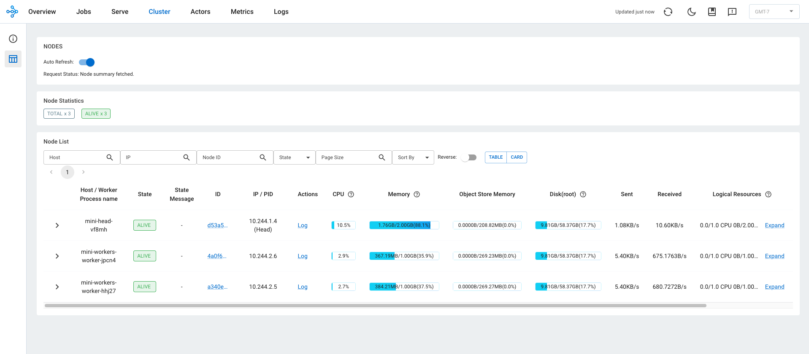
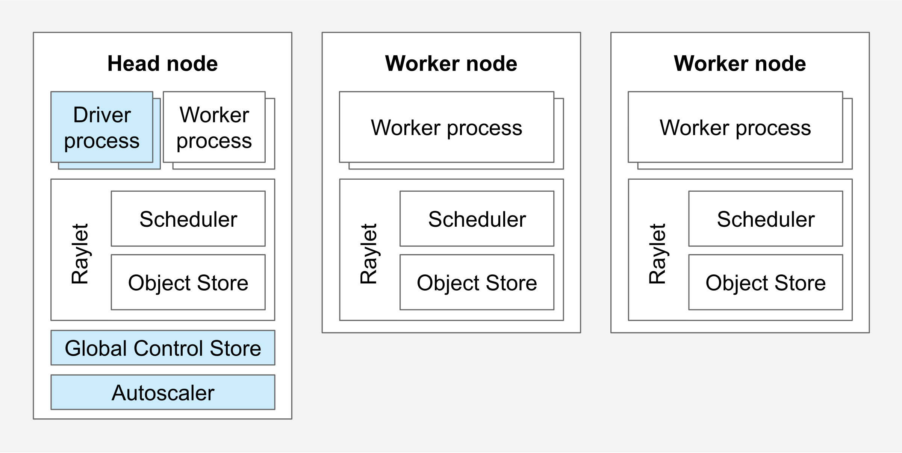

I am running on a 2021 M1 Mac with 16 GB RAM.

First I am going to install kind (Kubernetes on Docker) so that I can run k8s clusters locally without going to the cloud and spend money before I needed to. I have previously already installed Docker desktop so I will use that as my docker runtime.

Install kind with:

```
% brew install kind
```

After installation, you should see something like:

```
% which kind
/opt/homebrew/bin/kind
```

I then can verify that I have `kubectl` installed. `kubectl` is the CLI tool that allows you to interact with the cluster easily via commands.

```
% which kubectl
/usr/local/bin/kubectl
```

I then checked docker:

```
% docker system df
TYPE            TOTAL     ACTIVE    SIZE      RECLAIMABLE
Images          4         2         542.7MB   430.1MB (79%)
Containers      2         0         0B        0B
Local Volumes   1         1         12.78MB   0B (0%)
Build Cache     109       0         12.22GB   11.98GB
```

And observed that I have 11.98GB of build cache that can be removed so I did

```
docker builder prune
```

to delete it. And rerunning docker system df shows that I have a almost clean slate

```
% docker system df
TYPE            TOTAL     ACTIVE    SIZE      RECLAIMABLE
Images          0         0         0B        0B
Containers      0         0         0B        0B
Local Volumes   0         0         0B        0B
Build Cache     19        0         245.4MB   245.4MB
```

I then updated the docker system limit by going to the docker desktop app, clicking the gear icon, and updated memory to 10GB. This will give us enough memory to run the small local cluster.

Also install uv and setup our environment:

```
curl -LsSf https://astral.sh/uv/install.sh | sh
uv sync
```

Now the next step is to spin up the local cluster. And we will start from writing a **Cluster Config**: as the name suggests, this is a yaml config that specifies how to spin up a kubernetes cluster.

creating a kind-config.yaml file with the following content

```
kind: Cluster
apiVersion: kind.x-k8s.io/v1alpha4
name: kind-cluster
nodes:
  - role: control-plane
  - role: worker
  - role: worker
```

Let's break it down line by line:

1. kind: Cluster. The type of object we are defining. (The field is called `kind` on every Kubernetes-style object; the name collision with the kind tool is a coincidence.)
2. apiVersion: `group/version`, i.e. who owns the schema and which revision of it. The group kind.x-k8s.io belongs to the kind project, a Kubernetes special interest group (SIG) subproject. v1alpha4 is nominally an alpha schema, but it has been unchanged for years and is stable in practice.
3. name: name of the cluster
4. nodes: a list where each entry becomes a docker container running a whole kubernetes node.

Notice that when running a cluster on kind, each node would be a container, but in a real cluster they are usually a machine. And you schedule pods on top of it, which are groups of one or more containers with configuration that can run workloads. So here we are essentially running containers inside containers.

To create a local cluster, I ran

```
% kind create cluster --config chapters/01-foundations/kind-config.yaml
Creating cluster "kind-cluster" ...
 ✓ Ensuring node image (kindest/node:v1.37.0) 🖼️
 ✓ Preparing nodes 📦 📦 📦
 ✓ Writing configuration 📜
 ✓ Starting control-plane 🕹️
 ✓ Installing CNI 🔌
 ✓ Installing StorageClass 💾
 ✓ Joining worker nodes 🚜
Set kubectl context to "kind-kind-cluster"
You can now use your cluster with:

kubectl cluster-info --context kind-kind-cluster

Thanks for using kind! 😊
```

Then I checked out the cluster with

```
% kubectl get nodes
NAME                         STATUS   ROLES           AGE   VERSION
kind-cluster-control-plane   Ready    control-plane   17m   v1.37.0
kind-cluster-worker          Ready    <none>          17m   v1.37.0
kind-cluster-worker2         Ready    <none>          17m   v1.37.0
```

and

```
% kubectl get pods -A
NAMESPACE            NAME                                                 READY   STATUS    RESTARTS   AGE
kube-system          coredns-559f6c778d-dtd79                             1/1     Running   0          18m
kube-system          coredns-559f6c778d-nnbqf                             1/1     Running   0          18m
kube-system          etcd-kind-cluster-control-plane                      1/1     Running   0          18m
kube-system          kindnet-4kb2p                                        1/1     Running   0          18m
kube-system          kindnet-d57gp                                        1/1     Running   0          18m
kube-system          kindnet-gtwbr                                        1/1     Running   0          18m
kube-system          kube-apiserver-kind-cluster-control-plane            1/1     Running   0          18m
kube-system          kube-controller-manager-kind-cluster-control-plane   1/1     Running   0          18m
kube-system          kube-proxy-hxxcx                                     1/1     Running   0          18m
kube-system          kube-proxy-j9x4w                                     1/1     Running   0          18m
kube-system          kube-proxy-s7r8r                                     1/1     Running   0          18m
kube-system          kube-scheduler-kind-cluster-control-plane            1/1     Running   0          18m
local-path-storage   local-path-provisioner-75f7fc7dc5-fs7n2              1/1     Running   0          18m
```

to check docker status, go to docker desktop under containers or run

```
% docker ps
CONTAINER ID   IMAGE                  COMMAND                  CREATED          STATUS          PORTS                       NAMES
6f99da4c5fa6   kindest/node:v1.37.0   "/usr/local/bin/entr…"   23 minutes ago   Up 23 minutes                               kind-cluster-worker
d16763ba168a   kindest/node:v1.37.0   "/usr/local/bin/entr…"   23 minutes ago   Up 23 minutes   127.0.0.1:58317->6443/tcp   kind-cluster-control-plane
53ba0fe2b205   kindest/node:v1.37.0   "/usr/local/bin/entr…"   23 minutes ago   Up 23 minutes                               kind-cluster-worker2
```

Now create the whoami.yaml file, this will create a minimal distributed service that prints its own hostname. Let's explain each line by line again.

1. metadata: a few metadata types, name is the identifier of this object, it needs to be unique per kind inside a namespace. since we did not specify a namespace, we are using the default namespace. other posible metadatas are namespace, etc. which can be looked up with `kubectl explain deployment.metadata`
2. Under spec: `replicas` is the desired number of pods.
3. `selector` `matchLabels`: a map of key/value pairs. Any pod carrying the label app=whoami belongs to this deployment.
4. `template` is a blueprint of the pod, which is exactly what each replica is
5. the `labels` that the pods have must match the selector criteria above so here they must carry the pair app=whoami
6. `containers` specify container details.
7. `---` is a yaml document separator: it splits the file into two documents, and `kubectl apply` treats each as an independent object
8. `selector` selector in a Service means traffic goes to pods that carries this selection of labels. A Service here exposes an abstraction over pods because they can cycle and their ips can change after lifecycles, but the Service keeps a stable IP and DNS name. The control plane keeps an EndpointSlice updated with the IPs of pods currently matching the label, and kube-proxy programs rules on every node so traffic to the Service IP lands on one of them.

Now its time to deploy. to deploy use `kubectl apply -f`

```
% kubectl apply -f chapters/01-foundations/manifests/whoami.yaml
deployment.apps/whoami created
service/whoami created
```

And you can use -w to watch the pods continuously

```
% kubectl get pods -o wide -w
NAME                     READY   STATUS    RESTARTS   AGE   IP           NODE                   NOMINATED NODE   READINESS GATES
whoami-8f4cfb89f-jv7ws   1/1     Running   0          16s   10.244.1.2   kind-cluster-worker2   <none>           <none>
whoami-8f4cfb89f-wfzcq   1/1     Running   0          16s   10.244.2.2   kind-cluster-worker    <none>           <none>
```

When both are running, confirm the service at:

```
% kubectl get svc whoami
NAME     TYPE        CLUSTER-IP     EXTERNAL-IP   PORT(S)   AGE
whoami   ClusterIP   10.96.243.67   <none>        80/TCP    2m10s
```

And start port forwarding so we can interact with it. the following command port forward the local 8080 port to the container's port 80 for the whoami service.

```
kubectl port-forward svc/whoami 8080:80
```

Start **Another terminal** and run

```
for i in 1 2 3 4 5 6; do curl -s localhost:8080 | grep Hostname; done
```

You should see the hostname of the pod handling the request. You might expect 2 but only 1 shows up: `kubectl port-forward` opens a tunnel to a single pod and stays on it, so it bypasses the Service's load balancing entirely.

to see different pods showing up and accepting request, do the following, which spins up a throwaway pod inside the cluster to send the requests through the Service's DNS name

```
kubectl run curl --image=curlimages/curl --restart=Never -- sh -c 'for i in $(seq 1 20); do curl -s whoami | grep Hostname; done'
kubectl wait --for=jsonpath='{.status.phase}'=Succeeded pod/curl
kubectl logs curl
kubectl delete pod curl
```

Now we will be installing `helm`, a kubernetes package manager that renders templated manifests and applies them. Let's install it with:

```
brew install helm
helm repo add kuberay https://ray-project.github.io/kuberay-helm/
helm repo update
helm search repo kuberay
```

Again, step by step guide:

1. we add the ray project repo to helm as a repo named kuberay
2. we can now look up the available charts (a package, in Helm's language) in the repo. Note down the version of the kuberay-operator as we will use it.

```
% helm install kuberay kuberay/kuberay-operator --version 1.7.0
NAME: kuberay
LAST DEPLOYED: Thu Sep 10 17:55:58 2026
NAMESPACE: default
STATUS: deployed
REVISION: 1
DESCRIPTION: Install complete
TEST SUITE: None
```

And now if you check the pods you will see the kuberay operator now running as another pod:

```
% kubectl get pods -w
NAME                                READY   STATUS    RESTARTS   AGE
kuberay-operator-54677d6b66-6kncw   1/1     Running   0          2m51s
whoami-8f4cfb89f-jv7ws              1/1     Running   0          16h
whoami-8f4cfb89f-wfzcq              1/1     Running   0          16h
```

Note that `kuberay` is the Helm release name (used for `helm upgrade` / `helm uninstall`), while the Deployment it created is named `kuberay-operator` because this chart hardcodes that name in its default values. Use `kubectl get deployment` to check what was deployed:

```
kubectl get deployment kuberay-operator -o yaml
```

And now we will continue by picking a ray image that we will use to deploy to our pods, run the following command to confirm the image exists and has an arm64 build (needed on Apple Silicon). Here we are using the latest Ray 2.58.0 and a well supported python version 3.12

```
% docker manifest inspect rayproject/ray:2.58.0-py312
{
   "schemaVersion": 2,
   "mediaType": "application/vnd.docker.distribution.manifest.list.v2+json",
   "manifests": [
      {
         "mediaType": "application/vnd.docker.distribution.manifest.v2+json",
         "size": 2210,
         "digest": "sha256:507464fe56b3d24cec2e812a25850db91b97d52752d63119fecf6914f7b0a37a",
         "platform": {
            "architecture": "amd64",
            "os": "linux"
         }
      },
      {
         "mediaType": "application/vnd.docker.distribution.manifest.v2+json",
         "size": 2210,
         "digest": "sha256:292ddde0ec904d1558635c39b66c3b11b2a1c2dca1222678cd9e42f9ed85aa70",
         "platform": {
            "architecture": "arm64",
            "os": "linux",
            "variant": "v8"
         }
      }
   ]
}
```

Now we will be deploying a Ray Cluster, which spins up a Ray head pod plus a group of worker pods that you can schedule and run workloads on. Inspect the `raycluster.yaml` and check out the fields:

- `rayVersion` tells the operator which Ray it's managing so it can pick compatible defaults. It should match the image that you are using.
- `headGroupSpec` describes the one head pod. The head runs the global control state, the dashboard, and the job server. rayStartParams are flags passed to ray start inside the container; dashboard-host: 0.0.0.0 makes the dashboard listen on all interfaces so port-forward can reach it. Here we also set the `num-cpus` for the head node to 0, which is a standard production setting to avoid ray from scheduling jobs on the head node.
- `workerGroupSpecs` is a list because you can have differently shaped worker pools, for example a CPU group and a GPU group. replicas is what you want now. minReplicas and maxReplicas are bounds for the Ray autoscaler, which is off by default, so for now they're inert. We'll turn it on in the autoscaling chapter.
- `resources.requests` is what the scheduler uses to place the pod. limits is what the kernel enforces. Setting them equal gives predictable behavior, which matters for Ray since it sizes its own worker pool from what it sees.

Apply and we can see the following

```
% kubectl apply -f chapters/01-foundations/manifests/raycluster.yaml
raycluster.ray.io/mini created
```

Check that its running by listing the resource type:

```
% kubectl get raycluster
NAME   DESIRED WORKERS   AVAILABLE WORKERS   CPUS   MEMORY   GPUS   STATUS   AGE
mini   2                 2                   3      4Gi      0      ready    10m
```

Check out how the ray cluster got provisioned:

```
kubectl describe raycluster mini
kubectl get events --sort-by=.lastTimestamp
```

Now check all the services running and port forward the ray head node dashboard which is on the head-svc at port 8265

```
kubectl get svc
kubectl port-forward svc/mini-head-svc 8265:8265
```

Then navigate to http://localhost:8265/#/cluster to checkout the cluster that you just setup. You should see 3 nodes, a head node named `mini-head-*` which is responsible for coordination in the cluster, and two worker nodes named `mini-workers-worker-*`. All workers have a dashboard agent to collect metrics that you can see here and a runtime env agent to manage runtime environments for any jobs running on them.


Now we can run our first job on the cluster. run the following to upload the working directory and submit the python script to the ray cluster.

```
uv run ray job submit --address http://localhost:8265 --working-dir chapters/01-foundations/jobs -- python where_am_i.py
```

You should see the job submitting and the ray cluster nodes' cpu spiking up while it handles the request. The job would also be available in the `Jobs` panel of the dashboard.

Note that here we have submitted the job to ray head node's 8265 port, which is the dashboard port and you might be wondering why as you might have seen when listing the k8s services that there are many ports other than this. That is because ray exposes different ports for listening to different purposes:

- 6379 for the Global Control Store
- 8265 for Dashboard HTTP and the Jobs Rest API
- 10001 for Ray Client gRPC
- 8080 for Prometheus metrics
- 8000 for Ray Serve HTTP ingress

Now let's try to scale out our cluster so that it can handle more traffic. Edit replicas: 2 to replicas: 3 in the worker group of raycluster.yaml, then apply it and wait for the new worker pod to show up. Notice it landed on one of the two kind worker nodes (worker template changes are reconciled live; head template changes are not, and need a delete + apply):

```
kubectl apply -f chapters/01-foundations/manifests/raycluster.yaml
kubectl get pods -o wide -w
```

Submit the jobs again, this time you should see 3 different workers handling them:

```
uv run ray job submit --address http://localhost:8265 --working-dir chapters/01-foundations/jobs -- python where_am_i.py
```

If you want to recreate the entire stack, here is a condensed list, try it yourself and time it to see how long it takes for a cluster to be spun up and start taking requests:

```
kind delete cluster --name kind-cluster
kind create cluster --config chapters/01-foundations/kind-config.yaml
kubectl apply -f chapters/01-foundations/manifests/whoami.yaml
helm install kuberay kuberay/kuberay-operator --version 1.7.0
kubectl apply -f chapters/01-foundations/manifests/raycluster.yaml
kubectl get pods -w   # wait until all pods are ready
kubectl port-forward svc/mini-head-svc 8265:8265
uv run ray job submit --address http://localhost:8265 --working-dir chapters/01-foundations/jobs -- python where_am_i.py   # one last time, in a separate terminal
```

This sequence took me around 3 minutes as reference.

Now tear down the cluster and clean up the resources:

```
kind delete cluster --name kind-cluster
```



---

## Appendix

### A. The head pod ran out of memory

My first RayCluster gave the head 2Gi. The first job died immediately:

```
Status message: Unexpected error occurred: 1 worker(s) were killed due to the node running low on memory.
Memory on the node (IP: 10.244.1.4) was 1.99GB / 2.00GB (0.997005)
Selected to kill: (Task: ... task name=_ray_internal_job_actor_...:JobSupervisor.__init__, actual memory used=0.04GB)
Top 10 memory users: PID  MEM(GB) COMMAND
20    0.19  .../ray/gcs/gcs_server
160   0.19  ray-dashboard-ServeHead-0
72    0.18  python -m ray.util.client.server
73    0.16  .../ray/dashboard/dashboard.py
71    0.15  .../ray/autoscaler/...
1     0.12  ray start --head --block
154   0.11  ray-dashboard-MetricsHead-0
155   0.11  ray-dashboard-DataHead-0
526   0.09  ray::DashboardAgent
158   0.08  ray-dashboard-NodeHead-0
```

The killed process (`JobSupervisor`, the actor that runs a submitted script) used 0.04GB. It died because the head was already full before any user code ran: GCS, the dashboard modules, the client server and the autoscaler add up to roughly 1.4GB on their own, plus the object store and page cache, which the container's memory accounting also counts.

Lessons:

- A framework's control plane has a memory floor that has nothing to do with your workload.
- The `limits.memory` you write is enforced hard. Ray's own monitor kills at 95% of it.
- Fix: head `memory: 4Gi` and `num-cpus: "0"` so no tasks land on the head. KubeRay does not rebuild a running head when its template changes, so this needed `kubectl delete -f` then `apply -f`, and the port-forward died with the old head pod.

### B. "Infeasible resource requests" during the job

The job prints 40 tasks at once, each asking for 1 CPU, on a cluster with 3 CPUs. You will see:

```
(raylet) There are tasks with infeasible resource requests that cannot be scheduled. ...
(autoscaler +5s) No available node types can fulfill resource requests {'CPU': 1.0}*14. Add suitable node types to this cluster to resolve this issue.
```

Nothing failed. 3 tasks run, the rest wait in the scheduler queue, and the job still finishes in about 13 seconds. The autoscaler component on the head sees the pending demand and reports that it has no way to add nodes, because autoscaling is off and `maxReplicas` is already reached. The "infeasible" wording is over-alarming; the tasks were feasible, just delayed.

That log line is the demand signal an autoscaler acts on. With autoscaling enabled and room in `maxReplicas`, Ray asks KubeRay for more worker pods instead of logging. On kind they would then fail to schedule for lack of node capacity, which is where a cloud cluster autoscaler takes over. Chapter 5.

Also in the resources dump: `'CPU': 3.0` confirms the head contributes 0 CPUs, `memory` is exactly the sum of the pod requests, and `object_store_memory` is about 30% of worker memory, Ray's default reservation for objects shared between tasks.

### C. Scaling back down

Setting worker `replicas` from 3 back to 2 and applying makes the operator pick one worker pod and delete it. Worker changes are reconciled live; head changes are not (see A).

### D. What you built, and how it maps to production

Bottom to top:

1. Your Mac
2. Docker Desktop's Linux VM (10GB memory cap)
3. 3 containers from `kindest/node`, acting as Kubernetes nodes
4. Kubernetes system pods: control plane on `kind-cluster-control-plane` (etcd, kube-apiserver, kube-controller-manager, kube-scheduler), and per-node agents on every node (kindnet, kube-proxy), plus coredns and local-path-provisioner
5. Your pods: whoami x2, kuberay-operator, Ray head, Ray workers x2
6. A job running inside the Ray worker pods

| Layer | What you have | What production has | Chapter |
|---|---|---|---|
| Machines | 3 Docker containers on one Mac | VMs or bare metal, some with GPUs | 6 |
| Cluster | kind | EKS / GKE / AKS or self-managed | 6 |
| Networking | port-forward | LoadBalancer, Ingress, an L7 router | 6, 7 |
| Storage | local-path-provisioner | Persistent volumes, object storage for weights | 4 |
| Workload | whoami, a Ray cluster running a toy job | vLLM serving Qwen3.8-27B | 3, 4 |
| Scaling | you edit `replicas` | a metric edits it for you | 5 |
| Observability | Ray dashboard, `kubectl get` | Prometheus, Grafana, alerts | 5 |
| Access | you, on localhost | your coding agent, with auth | 8 |

Every row on the left is the same Kubernetes object as the right. The rest of the guide swaps rows one at a time.

### E. Things to remember

- Everything is declared desired state; a controller makes reality match it. The Deployment controller, the Service/EndpointSlice machinery and the KubeRay operator all work this way.
- `kubectl port-forward` pins to one pod; load balancing only happens inside the cluster.
- `kubectl explain <kind>.<path>` is the schema for the exact version you are running.
- A Helm release name and the resources it creates are different names.
- A framework's control plane has a memory floor; give the head room.
- The driver of a submitted job runs on the head; your laptop only uploads and watches.
- Cluster state survives a Docker restart; port-forwards do not.
- Delete and recreate from files is the test that the chapter is complete. ~3 minutes here.
